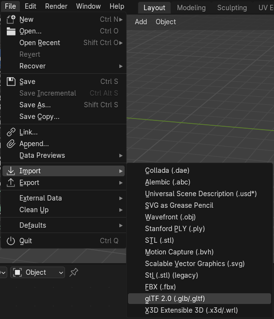
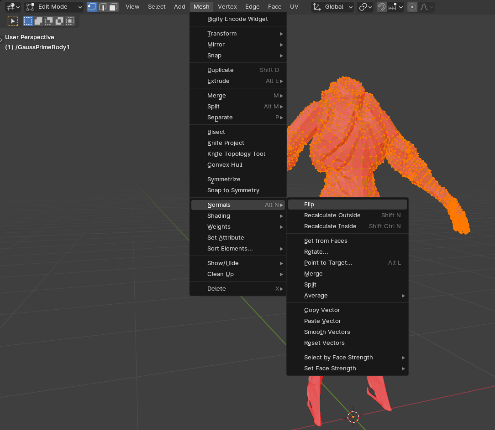
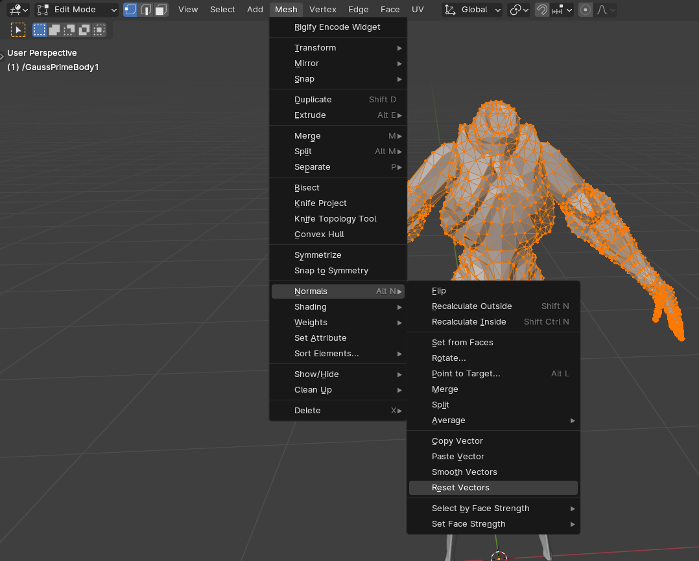

# Setting up models
To get started you will want to have a model, its textures and its material extracted in a directory you know.  
For information on extracting read through the [extractor](extractor/index.md) page.  
## Process  
This process was done on the 4.0.2 build of blender, however it is recommended to always use the latest build.  
This example will use Gauss Prime
### Importing  
#### Step 1.  Import
##### 1.1 glTF
Import .glb  
  

##### 1.2  Import Settings  
Find the files you extracted and import with these settings.

- Make sure that Guess Original Bind Pose is not checked.  
- Make sure that Bone Dir is set to Temperance (average).  

  

Your blender should contain the model that you imported as well as the skeleton of that model.  

- If you delete the skeleton temporarily and the mesh moves or flips it means you imported with the wrong settings.  

  

#### Step 2. Import Cleanup  
##### 2.1 Normals
As you can see, the face orientation is flipped.  

  

We need to flip these to be able to have our model display correctly.  
To do this enter Edit Mode, Mesh :octicons-arrow-right-24: Normals :octicons-arrow-right-24: Flip or press ++alt+n++ and then Flip.  

  

- They should now be blue. 

##### 2.2 Merge  
Not all models need it but it is best practice to merge by distance each mesh.
To do so go to Mesh :octicons-arrow-right-24: Clean Up :octicons-arrow-right-24: Merge by Distance or ++m++ and choose Merge by Distance.  

  

- Make Sure not to go any higher than this as you might remove parts of the actual geometry.  

  

##### 2.3 Vector  
Because of the merge we need to reset the vectors.
To reset these enter Edit Mode, Mesh :octicons-arrow-right-24: Normals :octicons-arrow-right-24: Reset Vectors or press ++alt+n++ and then Reset Vectors.  

  

##### 2.4 Shading
For the normal maps to work in future we need to set the mesh to shade smooth.
To do this go back to Object mode and click Object :octicons-arrow-right-24: Shade Smooth or Right Click and select Shade Smooth.  

  

#### Step 3. Shader
For this step you need to make sure that you extracted the material .txts and textures of the model, as well as converted your .dds textures to another format. Details on how to do that as well as how to convert the textures are on the [extractor](extractor/index.md) page.  

- In this guide we are using the Pruu Shader.  

##### 3.1 Shader Generation  
First we need to identify what shader generation the model uses, The process for doing so is detailed on the [shader](shaders/index.md) page.  
The shader gauss uses is G3.  
##### 3.2 Adding Shader  
I already know that we need a G3 Shader so we will append the `H_Khora_Deluxe` material from the `G123 Split Shader.blend` 
##### 3.3 Applying Shader 
Next, we want to copy the name of the material on the object which is `GaussPrimeBody` then we change the shader applied to `H_Khora_Deluxe` and then we change the name to `GaussPrimeBody` 
##### 3.4 Setting Up Shader 
This is where we want to go back into the folder where we extracted the Gauss Prime materials and textures to.
###### 3.4.1 Adding Textures
We then want to drag all of the textures that start with the same name as the material into the shader editor.  

- Make Sure that the textures are set to non colour.  

###### 3.4.2 Setting Textures 
Now we want to look at the shader and look at all of the image files that are already there.  
Then we want to replace them with the ones we dragged in.  
  

1. Tint mask
2. Normal map 
3. Emission map 
4. Packmap 

  

Now we are able to 