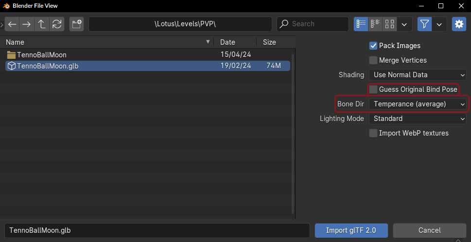
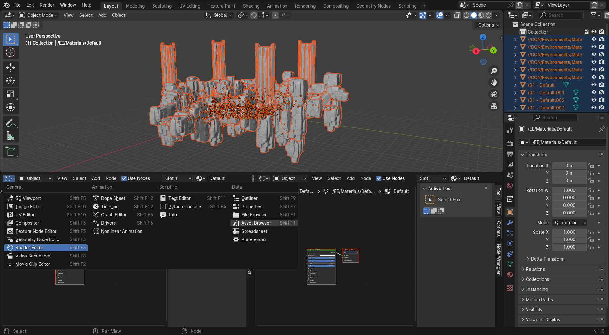
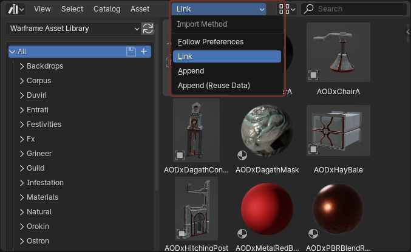
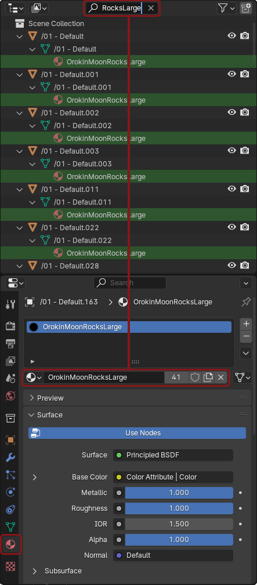
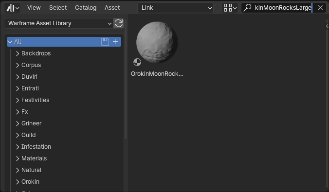
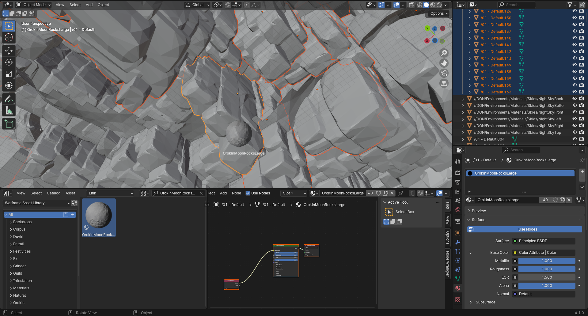
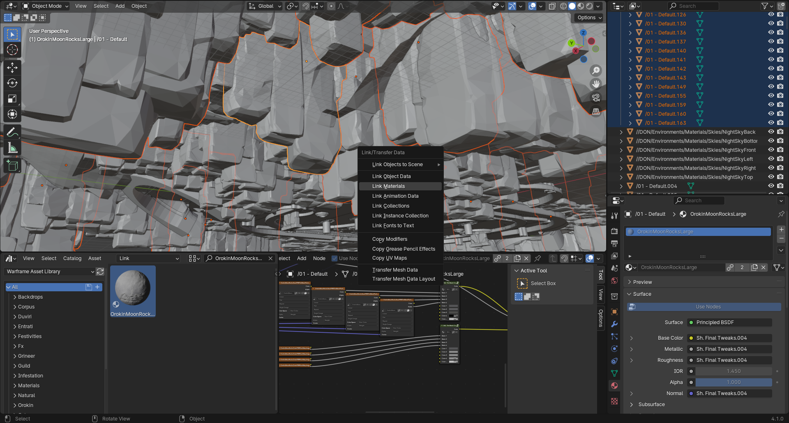

### Setting Up levels with the help of the Asset Library  

1. Import the level's .gltf file.  
  
	Make sure that you are using the correct import settings.  
	  

2. Split the window into 2 and select the asset browser.  
	  

	2.1. Change the dropdown to `Link`.  
	  
	
	2.2. Go to the outliner tab, then open the filter menu and check the Exact Match checkbox under the search options.  
	  

3. Select any mesh, Switch to the Material Properties, copy that material's name.  

	3.1. Paste the material's name into the search field in the outliner.  
	  
	
	3.2. Inside the outliner press A to select all of the objects with that material and then press M to create a new collection, its easiest to name the collection after the material that it contains, now you can clear the search.  
	  

	3.3. Search the Asset Library for the material, if it exists move on to the next step, if it does not exist in the asset library you will need to manually add it to the asset library. For how to do that refer to [Setting up missing Asset Library Materials](#Setting%20up%20Materials%20that%20are%20not%20in%20the%20Asset%20Library)  
	  

4. Inside the materials collection select one of the objects, and drag and drop the material onto that object.  
	  

	4.1. Keep the object that you had previously dropped the material on to selected and then select the rest of the objects inside the collection, if the object is no longer the active object shift click it, then you can press Ctrl+L and link the materials.  
	  

5. Once you have linked all the materials in that collection you can hide it and repeat the process until you have linked all materials that can be linked.  

### Setting up Materials that are not in the Asset Library  

#### Editing a Mesh 