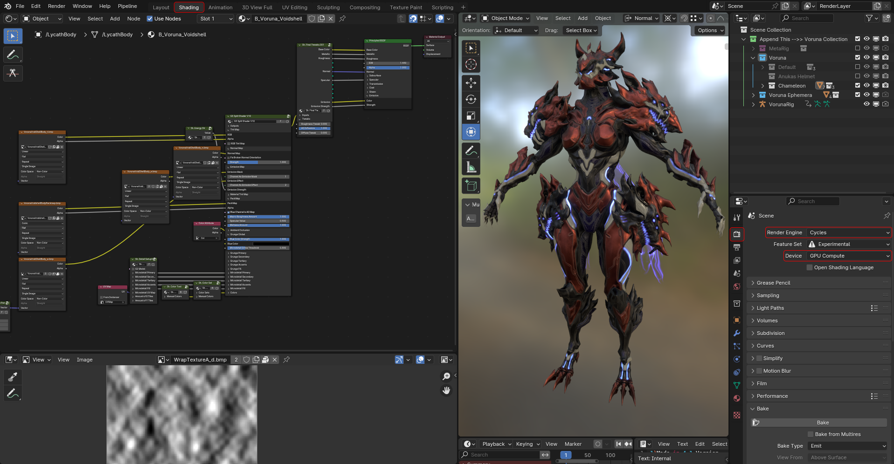
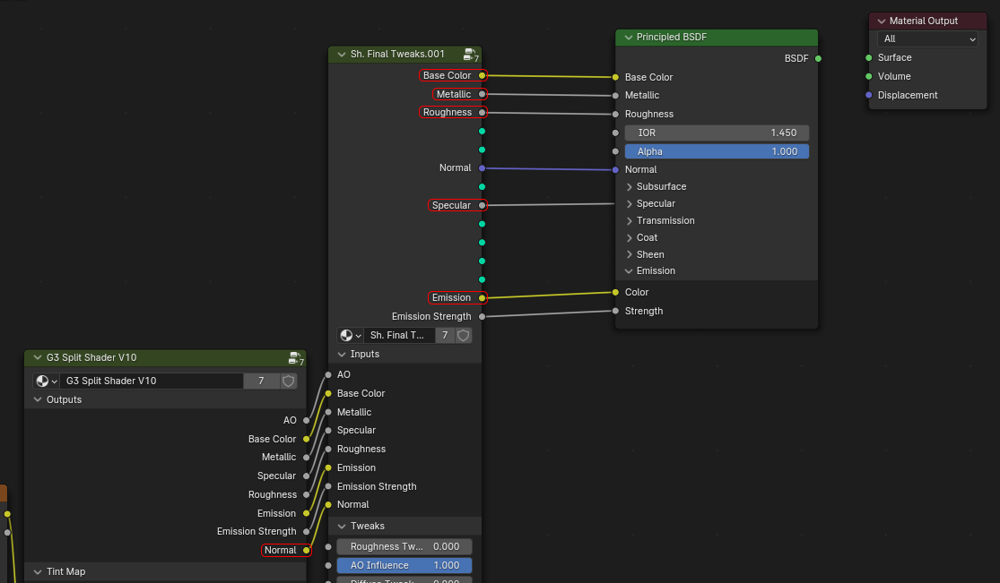
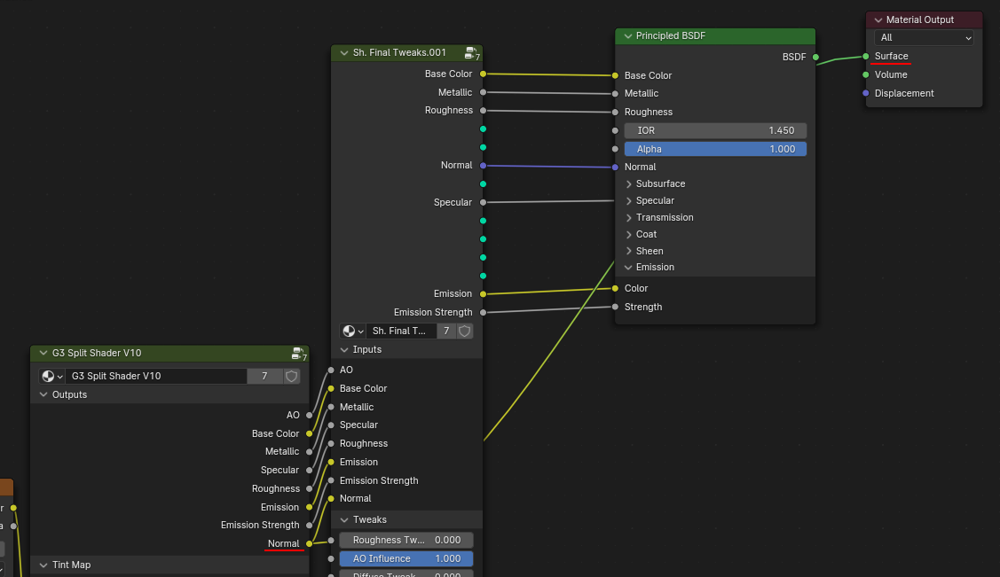
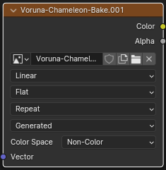
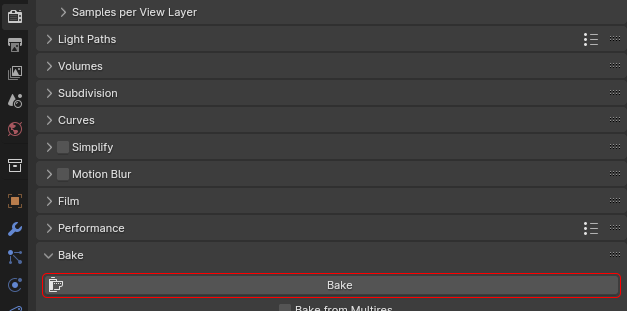

# Baking Textures
### Texture Type Table 
| Texture Type | Colour Space |
|:------------ |:------------ |
| Base Color   | sRGB         |
| Emission     | sRGB         |
| Metallic     | Non-Color    |
| Roughness    | Non-Color    |
| Specular     | Non-Color    |
| Normal       | Non-Color    |

???+ youtube "Early Video explaining the basics"
	<iframe width="560" height="315" src="https://www.youtube.com/embed/-naBXsdqMUM?si=uGImEt0tVGNJYw8s" title="YouTube video player" frameborder="0" allow="accelerometer; autoplay; clipboard-write; encrypted-media; gyroscope; picture-in-picture; web-share" allowfullscreen></iframe>  

## How to bake textures on Pruu models  

First of all, switch to the shading tab.  
Now set the render engine to cycles. If your computer is compatible  it is highly recommended to switch to the GPU Compute render device.  
You also want to open the samples panel and set it to a low number (1-4).  
    
  
Now you want to scroll down to the `Bake` section and input these settings:  
- Bake Type: Emit  
- Output, Target: Image Texture  
- Unchecked Clear Image  
- Margin, Size: from 2-5px  
{ width="75%" }  
  
Now you want to select the object that you want to bake in the viewport.  
Then in the shader editor create a new image texture node with ++shift+a++.  
  
  
In the image node create a new image and name it whatever you want, for this example we are using 2048x2048 but you can go higher if you want.  
Depending on what type of texture you will be baking, refer to the table at the top of the page and set the colour space accordingly.  
  
  
These sockets are where you can source the textures to bake from. 
  
  
Now you drag the output to the surface socket on the material output.  
  
  
After you have set up the texture to be baked make sure you have the newly created texture selected, it should have a white outline.  
  

Now you can go back yo the bake panel and click bake.  
  
  
Now if you switch a pane to an image editor tab and open the image you baked to you can save it.  
  